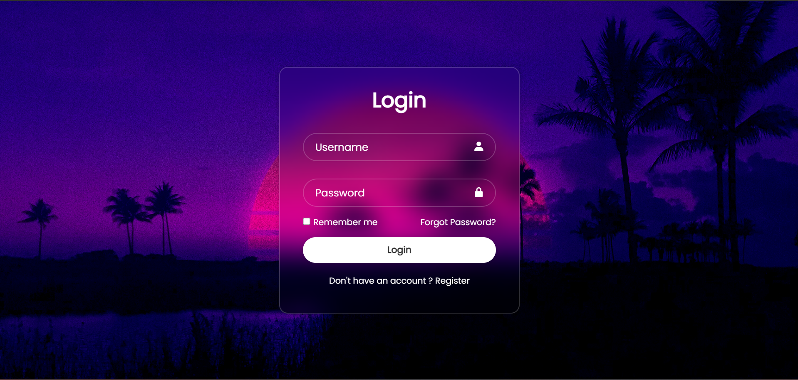

# Login Form Project

A sleek and modern login form created using HTML and CSS. This project demonstrates how to create a beautiful and user-friendly login form with icons, a background image, and a responsive design.

## Project Overview

This project aims to create a stylish login form that features:
- **User and Password Inputs**: With clear placeholders and icons.
- **Remember Me Checkbox**: Allows users to remember their credentials.
- **Forgot Password Link**: For users who need to reset their password.
- **Register Link**: Directs new users to the registration page.

### Output



### Key Features

- **Responsive Design**: Works well on various screen sizes.
- **CSS Styling**: Using Google Fonts and Boxicons for enhanced visuals.
- **Backdrop Blur**: Achieved using `backdrop-filter` for a glassy effect.
- **Boxicons Integration**: Icons are used for better UI and interactivity.

## Project Files

- **`index.html`**: Contains the HTML structure of the login form.
- **`style.css`**: Contains the styling and layout of the form.

## How to Use

1. Clone this repository:
   ```bash
   git clone https://github.com/your-username/login-form-project.git
